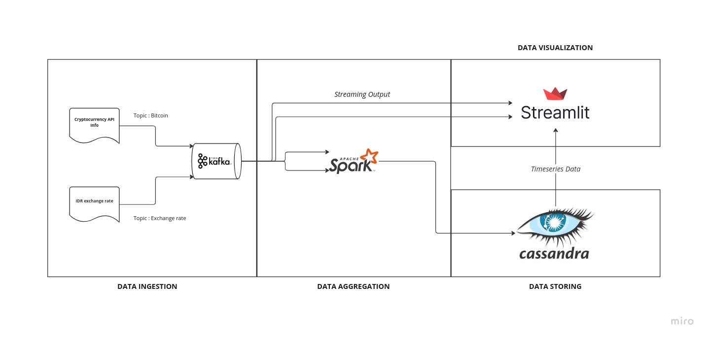

# Bitcoin Price Dashboard

# How to run ?

1. Run docker compose
        
        `docker compose up -d`
    
    open `http://localhost:9021/` for kafka control center.

2. Run each producer on kafka_resources folder
    
        `make producer-btc`
        `make producer-exchange-rate`

3. Run spark job to aggregrate data from kafka and write to postgres
    
        `make spark-aggregator`